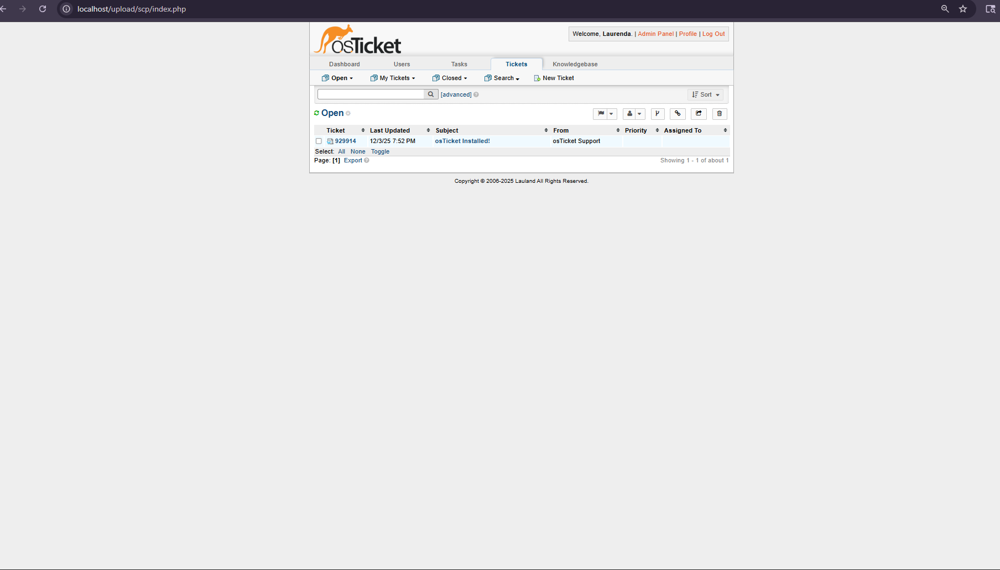
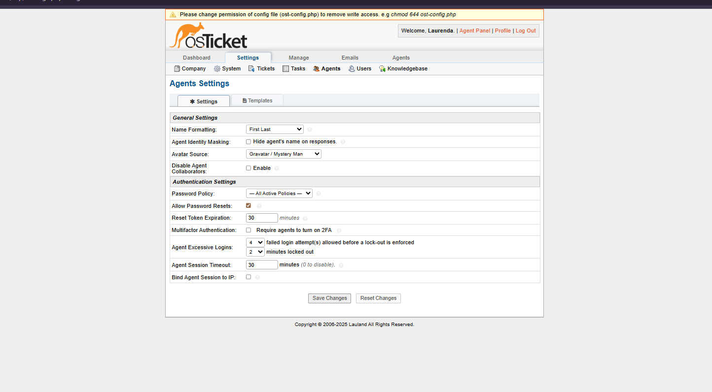
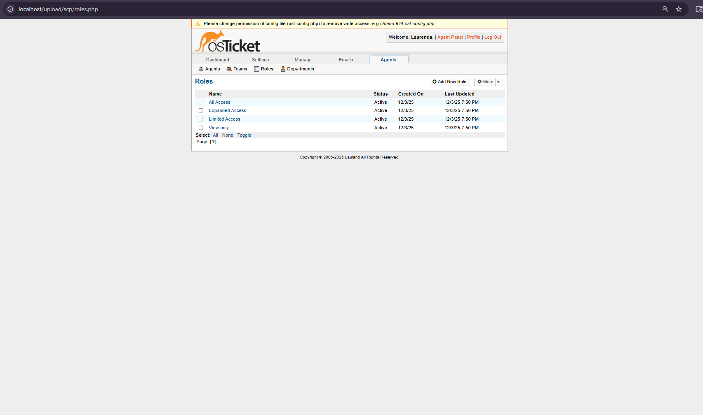
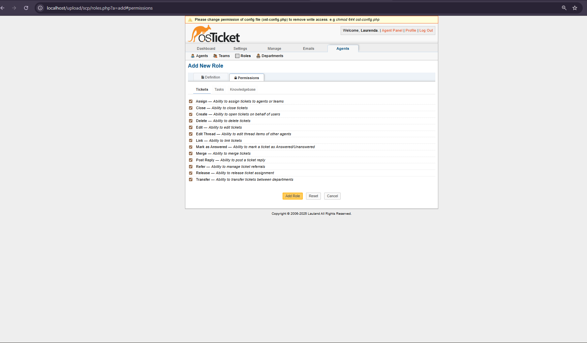
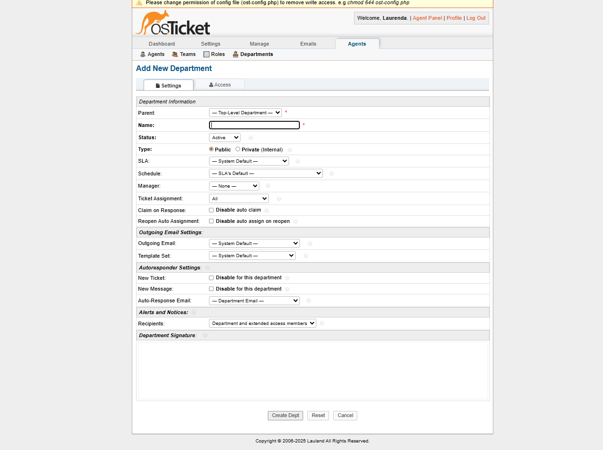
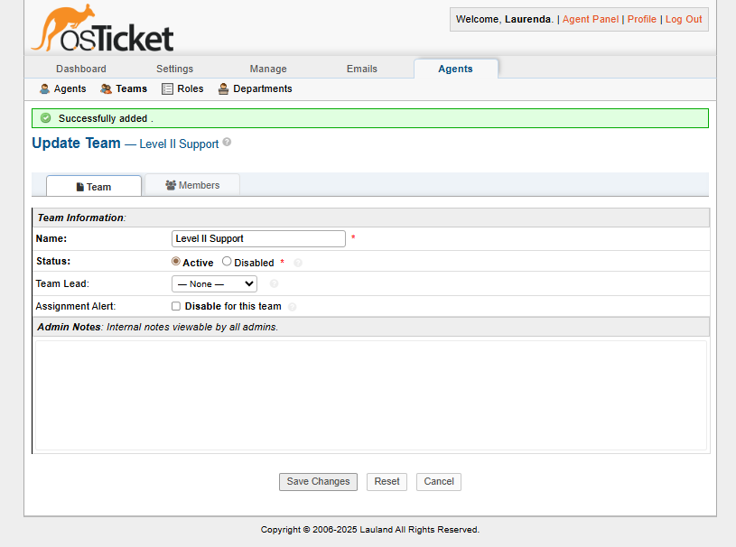
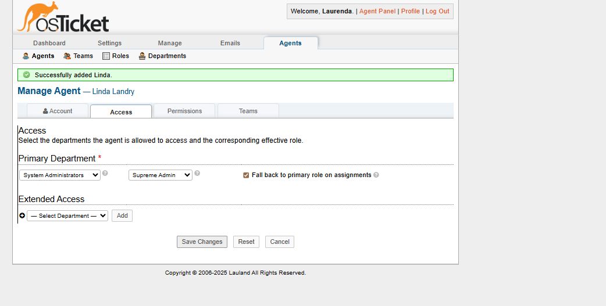

# osTicket: Post-Installation Configuration

## 📖 Overview
This tutorial demonstrates how to configure osTicket after installation. You'll learn how to set up roles, departments, teams, and agents to create a fully functional help desk system.

---

## 🔐 Step 1: Configure Roles
Roles define the permissions that agents have within the system.

### Creating a "Supreme Admin" Role
1. Navigate to: **Admin Panel → Agents → Roles**
2. Click **"Add New Role"**
3. Name: `Supreme Admin`
4. Go to **Permissions** tab
5. Check **ALL** permission boxes (Tickets, Tasks, Knowledgebase)
6. Click **"Add Role"**

*Viewing existing roles in the system*

*Configuring full permissions for Supreme Admin role*

---

## 🏢 Step 2: Configure Departments
Departments organize tickets by business function or responsibility.

### Creating a Department
1. Navigate to: **Admin Panel → Agents → Departments**
2. Click **"Add New Department"**
3. Enter department name (e.g., `System Administrators`)
4. Configure SLA, Manager, and Email settings as needed
5. Click **"Create Dept"**

*Overview of configured departments*

*Creating a new department with custom settings*

*Confirmation of successful department creation*

---

## 👥 Step 3: Configure Teams
Teams allow cross-departmental collaboration on specific issues.

### Creating a Team
1. Navigate to: **Admin Panel → Agents → Teams**
2. Click **"Add New Team"**
3. Name: `Level II Support`
4. Assign team members
5. Click **"Create Team"**

*Setting up a Level II Support team*

---

## 🧑‍💼 Step 4: Add Agents (Staff Members)
Agents are the staff members who handle tickets.

### Adding an Agent
1. Navigate to: **Admin Panel → Agents → Add New**
2. Fill in agent details:
   - Name, Email, Username
3. Set **Access** tab:
   - Primary Department: `System Administrators`
   - Role: `Supreme Admin`
4. Click **"Create"**

*Adding a new agent with department and role assignment*

---

## ✅ Completion
Your osTicket system is now configured with:
- ✔️ Custom roles with granular permissions
- ✔️ Organized departments
- ✔️ Collaborative teams
- ✔️ Authorized agents ready to handle tickets

## 🚀 Next Steps
- Configure SLA Plans
- Set up Email Settings
- Create Help Topics
- Add End Users
